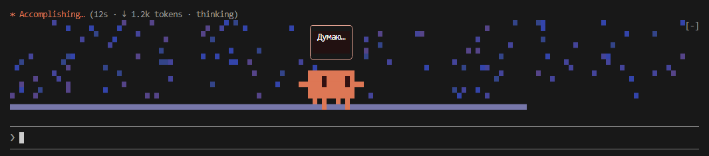

# pixel-clawd

A mod for [Claude Code](https://code.claude.com): **Clawd**, the orange pixel mascot, walks above the prompt while Claude is working and says what is happening right now.



## Install

In Claude Code:

```
/plugin marketplace add KarVarr/pixel-clawd
/plugin install clawd@pixel-clawd
/reload-plugins
```

It then loads in every session, no `--plugin-dir` needed.

## What it does

- Clawd appears only while Claude works and fades out when the turn ends. At most 8 rows tall; hidden in terminals narrower than 34 columns.
- A speech bubble (up to 60 characters, changes at most every 2 s) tells what is going on: the command's description, the file being read or edited, the search pattern. Common shell commands (tests, build, git, install) get their own phrases; other tools get canned ones.
- The background scene follows the tool: waves for shell, night sky for reading, falling symbols for search, rain for web, confetti for edits, a volcano for agents and MCP, a rising sun for git, a filling grid of green squares for tests, red tones on errors, purple squares while thinking. Phrasings vary, so it does not repeat itself.

## Commands

- `/clawd on` / `/clawd off`: show or hide the mascot (per session, on by default).

## Safety

Drawing and timers only. No network requests, no model calls, no file or environment access, and it never alters or blocks tool calls (`tool.call` always passes the event on). It never draws over the permission dialog. Check it yourself:

```
claude plugin validate clawd
```

It lists the hooks and `$` calls the mod uses.

## Compatibility

Mods (function hooks) are an **early-access** Claude Code API and may change between releases. Tested on Claude Code **2.1.287**, terminal only. The desktop app's Code tab draws it as an SVG in theory, but I have not seen it load there yet (reported not working), so treat the desktop as unsupported for now.

## Disable / remove

```
claude plugin disable clawd@pixel-clawd
claude plugin uninstall clawd@pixel-clawd
claude plugin marketplace remove pixel-clawd
```

## License

MIT, © 2026 Vardanian Karen
